# Етап машинного навчання

Регресійні та класифікаційні моделі в PySpark ML на рівні **користувача** Yelp (1 987 897 записів).

* **Регресія — кількість фанів користувача** (ціль `log(1 + fans)`). Найкраща модель `GBTRegressor`:
  RMSE **0,297**, R² **0,803** на тесті (базовий рівень «середнє»: RMSE 0,670, R² 0).
* **Класифікація — чи був користувач у Yelp Elite** (`is_elite`, 4,6% користувачів). Найкраща модель
  `MultilayerPerceptronClassifier` (нейронна мережа): Accuracy **0,985**, Precision **0,827**, Recall **0,837**,
  F1 **0,832** для класу «еліт» (правило «≥ 88 відгуків»: F1 0,678).

Код: [`src/ml/`](../../ml) · зошит з усіма виводами: [`src/notebooks/ml_models.ipynb`](../../notebooks/ml_models.ipynb) ·
таблиці: [`results.md`](results.md), [`tables/`](tables) · рисунки: [`figures/`](figures).

## Відповідність вимогам

| Вимога | Розділ звіту | Розділ зошита | Файли |
| --- | --- | --- | --- |
| 1. Регресійна та класифікаційна модель у PySpark | 1 | 3, 4 | `src/ml/training.py`, `src/ml/models.py` |
| 2. Попередня обробка даних | 2 | 2 | `src/ml/features.py`, `src/ml/pipeline.py` |
| 3. Мінімум 3 моделі для кожної задачі | 3 | 3, 4 | по 3 моделі різних типів |
| 4. Навчання та аналіз процесу навчання | 4 | 3.1–3.2, 4.1–4.2 | `src/ml/training.py`, `src/ml/plots.py` |
| 5. Метрики: RMSE, R²; Accuracy, Precision, Recall, F1 | 5 | 3.3, 4.3 | `src/ml/evaluation.py` |
| 6. Порівняння алгоритмів | 6 | 3.3, 4.3, 5 | `tables/*_comparison.csv` |

## 1. Постановка задач

| | Регресія | Класифікація |
| --- | --- | --- |
| Ціль | `log(1 + fans)` | `is_elite` — користувач був в Elite хоча б один рік |
| Розподіл | 79% користувачів мають 0 фанів, медіана 0, 99-й перцентиль 26, максимум — тисячі | 91 198 еліт (4,6%) |
| Чому так | без логарифма RMSE визначали б кілька «зірок» з тисячами фанів; `log1p` працює з нулями, помилка стає відносною | статус Elite присуджує Yelp (рада спільноти) за якість і активність — точного правила немає, тож модель має його відтворити |
| Вибір моделі | мінімальний RMSE на validation | максимальний PR-AUC на validation |

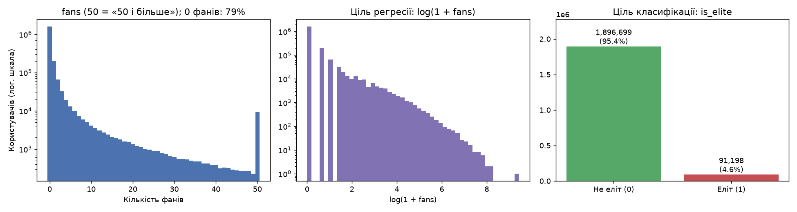

## 2. Попередня обробка даних

**Джерело** — таблиця `user` (3,4 ГБ JSON, більшість обсягу — списки друзів). Ознаки обчислюються один раз
(≈30 с) і зберігаються в Parquet `artifacts/processed/ml/user_features` (`src/ml/features.py`).

| Група | Ознаки | Перетворення |
| --- | --- | --- |
| Активність | `log_review_count`, `years_on_yelp`, `log_friends`, `average_stars` | `friends` (`"None"` або список id) → кількість; `yelping_since` → роки до дати знімка 2022-01-19 |
| Голоси | `log_useful`, `log_funny`, `log_cool`, `*_per_review` | `log1p`; голоси на один відгук — «якість» замість обсягу |
| Компліменти | 10 видів `log_compliment_*`, `log_compliments_total`, `compliments_per_review` | `log1p`, сума, на один відгук |
| Ціль іншої задачі | регресія: `is_elite`, `n_elite_years`; класифікація: `log_fans` | — |

Регресія використовує 24 ознаки, класифікація — 23.

**Очищення та особливості даних:**
* У колонці `elite` 2020 рік записано як `"20,20"` (наприклад, `"2019,20,20,2021"`); такі токени перетворюються на 2020.
* `compliment_funny` **повністю дублює** `compliment_cool` у всіх 1 987 897 записах (перевірено), тому не використовується.
* Spark 4 працює в ANSI-режимі (невдалий `cast` чи ділення на 0 кидають виняток), тому скрізь `try_to_date`, `try_divide`;
  ділення на 0 відгуків → 0.
* Пропусків у таблиці немає, дублікатів `user_id` немає (перевіряється після побудови).

**Захист від витоку:** жодна ознака не обчислюється з цілі своєї задачі (у регресії немає `fans`, у класифікації — нічого
з колонки `elite`; перевірено тестом). Ціль іншої задачі — звичайна ознака.

**Конвеєр Spark ML** (навчається лише на train): `Imputer(median)` → `VectorAssembler` → `StandardScaler(withMean, withStd)`.
Стандартизація потрібна нейронній мережі й factorization machine (градієнтні методи) і робить коефіцієнти лінійних моделей
порівнянними.

**Розбиття:** `xxhash64(user_id, seed=42) mod 100` — 70% train / 15% validation / 15% test; детерміноване, однакове
для обох задач.

| Вибірка | Рядків | Середнє `log(1+fans)` | Частка еліт |
| --- | --- | --- | --- |
| train | 1 391 658 | 0,270 | 4,58% |
| validation | 298 044 | 0,273 | 4,62% |
| test | 298 195 | 0,270 | 4,58% |

## 3. Моделі та протокол навчання

| Задача | Модель | Тип | Сітка гіперпараметрів |
| --- | --- | --- | --- |
| Регресія | `LinearRegression` | лінійна (L-BFGS) | `regParam` ∈ {0,001; 0,01; 0,1} |
| Регресія | `FMRegressor` | лінійна + попарні взаємодії ознак (factorization machine, AdamW, 50 ітерацій) | `stepSize` ∈ {0,001; 0,01; 0,1} |
| Регресія | `GBTRegressor` | ансамбль дерев, бустинг | `maxDepth` ∈ {3; 5}, кількість дерев ≤ 100 за кривою validation |
| Класифікація | `LogisticRegression` | лінійна (L-BFGS) | `regParam` ∈ {0,001; 0,01; 0,1} |
| Класифікація | `RandomForestClassifier` | ансамбль дерев, беггінг | (дерев, глибина) ∈ {(20; 8), (60; 8), (60; 14)} |
| Класифікація | `MultilayerPerceptronClassifier` | нейронна мережа (sigmoid, L-BFGS, 100 ітерацій) | приховані шари ∈ {[16], [32, 16], [64, 32]} |

**Протокол** однаковий для всіх моделей:
1. кожна точка сітки навчається на **train**, записуються час і метрики train/validation;
2. найкраща точка обирається на **validation**;
3. обрана модель оцінюється **один раз на test** (без донавчання на train+validation).

**Дисбаланс класів (4,6%):** нейронна мережа в Spark не підтримує ваги класів, тому для всіх трьох класифікаторів
поріг рішення обирається на validation за максимумом F1 і без змін застосовується до тесту. Метрики при порозі 0,5
теж наведено. Precision / Recall / F1 рахуються для класу «еліт» з матриці помилок; для тестових метрик —
95% bootstrap-інтервали (300 повторних вибірок).

## 4. Аналіз процесу навчання

### 4.1 Регресія

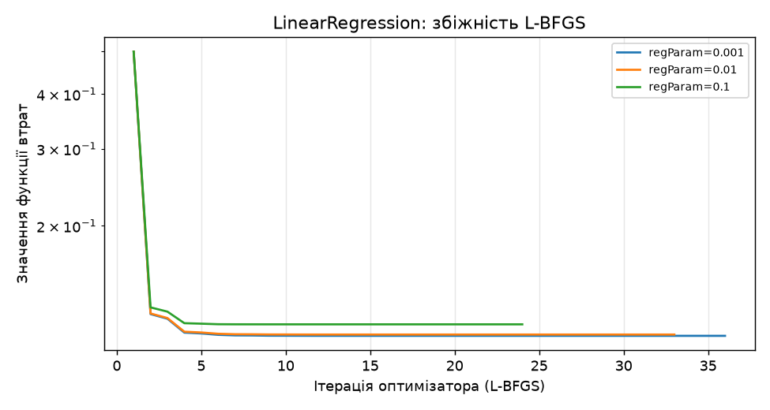
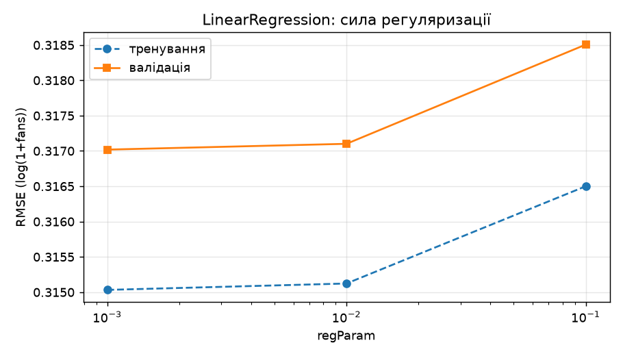

* **LinearRegression** зійшлася за 24–36 ітерацій L-BFGS. Регуляризація майже не впливає (val RMSE 0,317 → 0,319
  при `regParam` 0,001 → 0,1), а train ≈ validation (0,315 / 0,317) — модель недонавчена через лінійну форму, а не перенавчена.

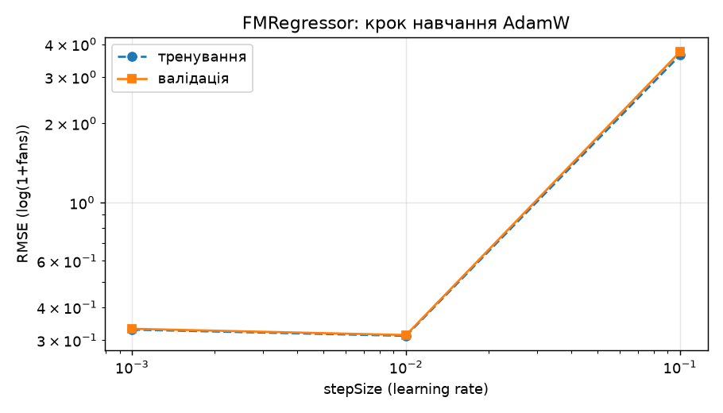

* **FMRegressor** — найчутливіший до кроку навчання: при 0,001 за 50 ітерацій не встигає навчитися (val RMSE 0,331),
  при 0,01 — найкращий (0,314), при 0,1 оптимізатор **розбігається** (RMSE 3,74 — гірше за просте середнє).

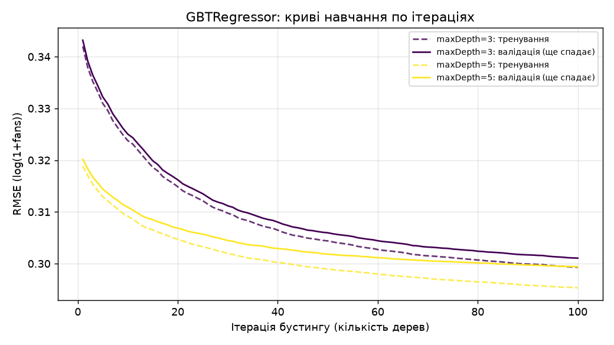

* **GBTRegressor**: RMSE на validation спадає до кінця бюджету в 100 дерев для обох глибин (найкраща ітерація = 100,
  тобто ще не досягнуто мінімуму); глибина 5 краща за 3 (0,299 проти 0,301). Розрив train/validation малий (0,295 / 0,299).

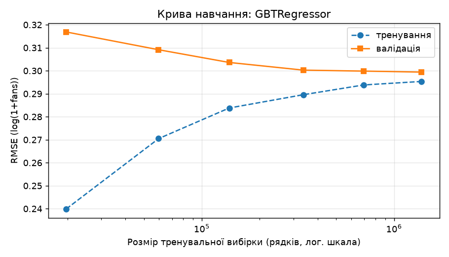

* **Крива навчання GBT**: на 19 732 рядках train RMSE 0,240 проти validation 0,317 (запам'ятовування); на 1,39 млн —
  0,295 / 0,299. Після ~0,3 млн рядків приріст мізерний — даних більш ніж достатньо.

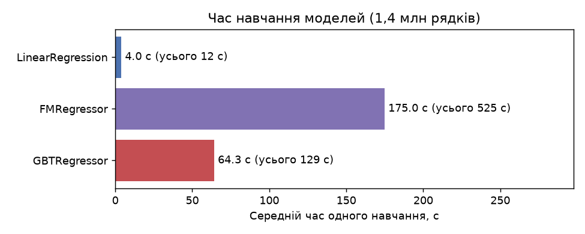

* **Час навчання** на 1,39 млн рядків: лінійна ~4 с, GBT ~55–75 с, FM ~170–190 с (повнопакетний AdamW).

### 4.2 Класифікація

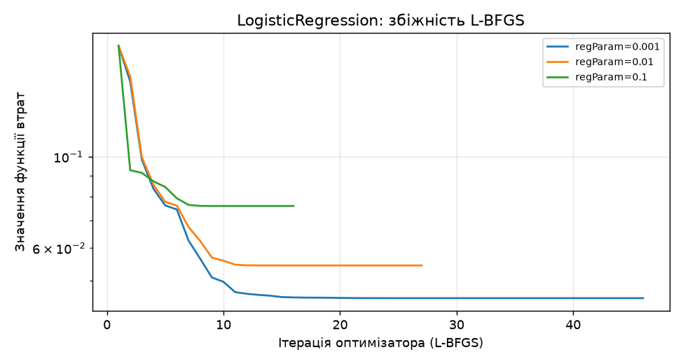
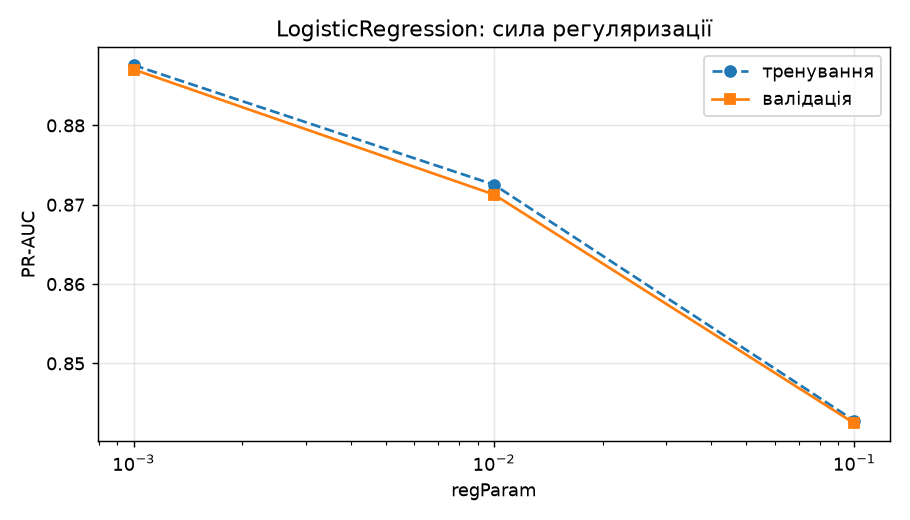

* **LogisticRegression**: L-BFGS сходиться за 16–46 ітерацій; сильніша регуляризація помітно шкодить
  (val PR-AUC 0,887 → 0,842 при `regParam` 0,001 → 0,1).

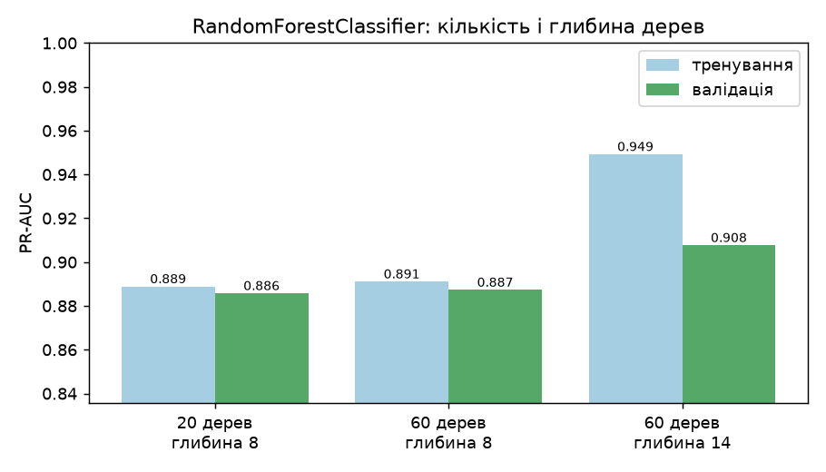

* **RandomForest**: 20 → 60 дерев глибини 8 майже нічого не дають (0,886 → 0,887), а глибина 14 — дає (0,908), але з
  помітним перенавчанням: train PR-AUC 0,949 проти validation 0,908.

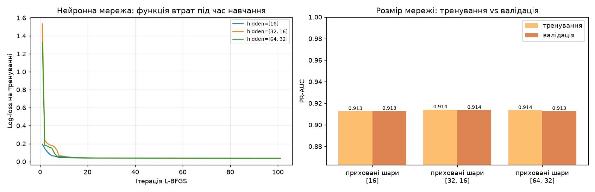

* **Нейронна мережа**: log-loss на тренуванні стабільно спадає за 100 ітерацій L-BFGS. Розмір мережі майже не впливає
  (val PR-AUC 0,913 / 0,914 / 0,913), а train ≈ validation — мережа не перенавчається. Обрано [32, 16].

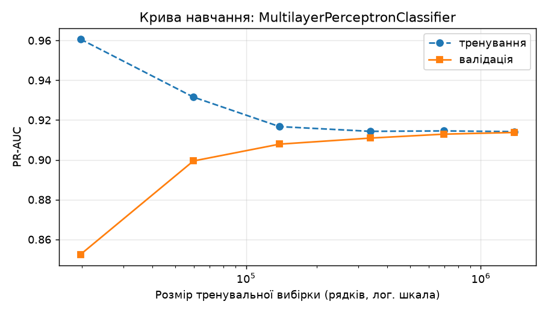

* **Крива навчання мережі**: на 19 732 рядках train 0,961 проти validation 0,852 (перенавчання), на повному train —
  0,914 / 0,914. Якість росте з обсягом до ~0,7 млн рядків.

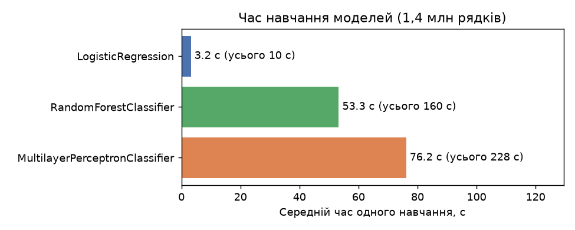

* **Час**: логістична регресія ~2–5 с, ліс 9–121 с, нейронна мережа 27–140 с (росте з розміром мережі).

## 5. Оцінка якості моделей (тестова вибірка)

### 5.1 Регресія: RMSE, R²

| Модель | RMSE | R² | MAE | 95% CI RMSE | MAE, фанів | Найкращі параметри | Навчання, с |
| --- | --- | --- | --- | --- | --- | --- | --- |
| Базова: середнє train | 0,670 | 0,000 | 0,429 | — | 1,62 | — | — |
| Базова: 0 фанів (медіана) | 0,722 | −0,163 | 0,270 | — | 1,44 | — | — |
| LinearRegression | 0,314 | 0,780 | 0,184 | [0,312; 0,316] | 0,84 | regParam 0,001 | 5,4 |
| FMRegressor | 0,310 | 0,786 | 0,180 | [0,308; 0,312] | 0,84 | stepSize 0,01 | 166,9 |
| **GBTRegressor** | **0,297** | **0,803** | **0,167** | [0,296; 0,299] | **0,74** | глибина 5, 100 дерев | 73,5 |

RMSE / R² / MAE — на шкалі `log(1 + fans)`; «MAE, фанів» — після зворотного перетворення `expm1`.
Train / validation / test RMSE: Linear 0,315 / 0,317 / 0,314; FM 0,311 / 0,314 / 0,310; GBT 0,295 / 0,299 / 0,297 —
жодна модель не перенавчилася.

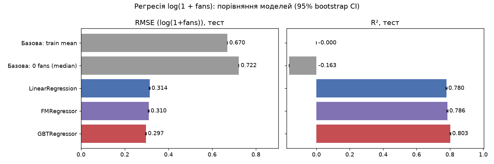

* **Парний bootstrap** GBT проти FM: різниця RMSE −0,013 [−0,014; −0,012], GBT кращий у 100% повторних вибірок.
* **Прогнози**: медіана прогнозу ≈ 0,1 фана для користувачів без фанів, ≈ 7 для групи 6–20, ≈ 30 для 21–100,
  ≈ 130 для понад 100. Залишки центровані (середнє +0,001).
* **Найважливіші ознаки**: у GBT — голоси `cool` (61% важливості), компліменти `plain`, кількість друзів, сума
  компліментів; у лінійній моделі — також `cool`, `funny`, сума компліментів, друзі, кількість елітних років.

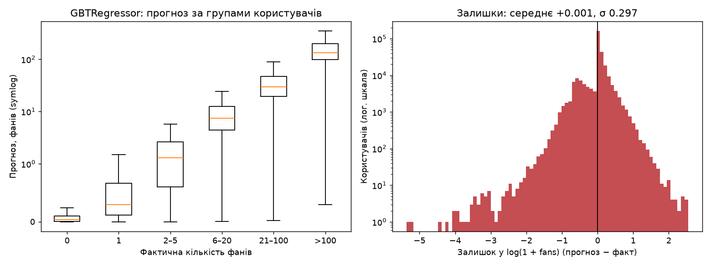
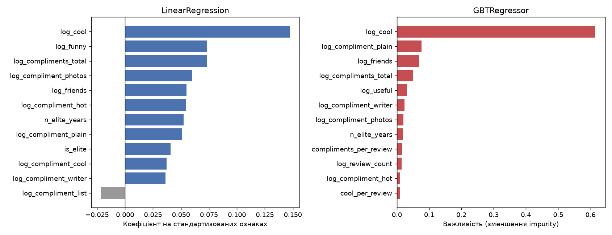

### 5.2 Класифікація: Accuracy, Precision, Recall, F1 (клас «еліт»)

Поріг кожної моделі обрано на validation:

| Модель | Поріг | Accuracy | Precision | Recall | F1 | 95% CI F1 | PR-AUC | ROC-AUC | Найкращі параметри | Навчання, с |
| --- | --- | --- | --- | --- | --- | --- | --- | --- | --- | --- |
| Базова: ніхто не еліт | — | 0,954 | 0,000 | 0,000 | 0,000 | — | ≈0,046 | 0,500 | — | — |
| Базова: `review_count` ≥ 88 | — | 0,968 | 0,633 | 0,730 | 0,678 | — | — | — | — | — |
| LogisticRegression | 0,37 | 0,983 | 0,812 | 0,818 | 0,815 | [0,810; 0,821] | 0,888 | 0,994 | regParam 0,001 | 4,6 |
| RandomForestClassifier | 0,42 | 0,984 | 0,821 | 0,834 | 0,828 | [0,823; 0,832] | 0,906 | 0,994 | 60 дерев, глибина 14 | 121,4 |
| **MultilayerPerceptronClassifier** | 0,43 | **0,985** | **0,827** | **0,837** | **0,832** | [0,828; 0,838] | **0,914** | **0,995** | шари [32, 16] | 61,5 |

При порозі 0,5 F1 трохи нижчий: 0,803 / 0,822 / 0,829 (Precision вищий, Recall нижчий).

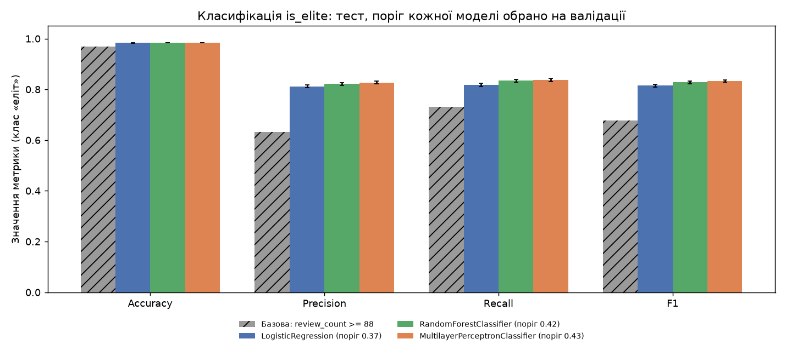
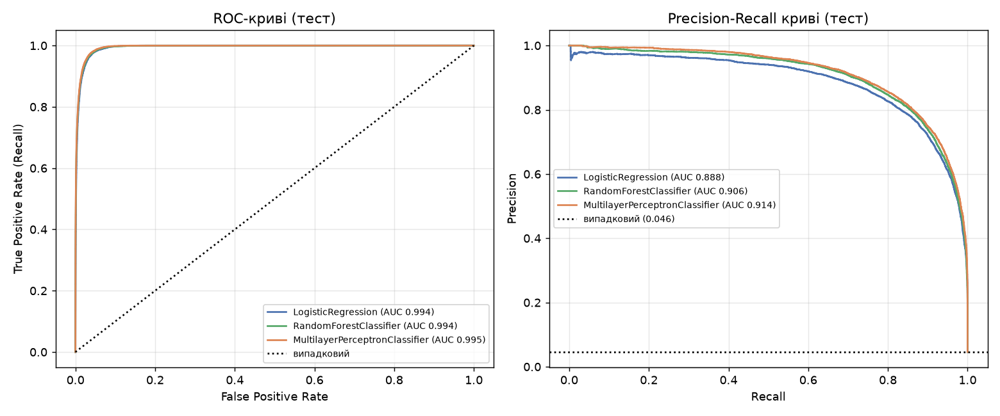
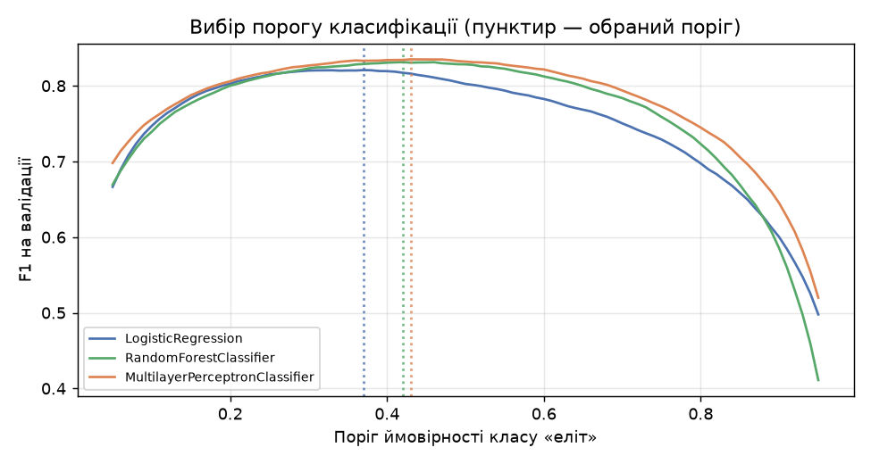
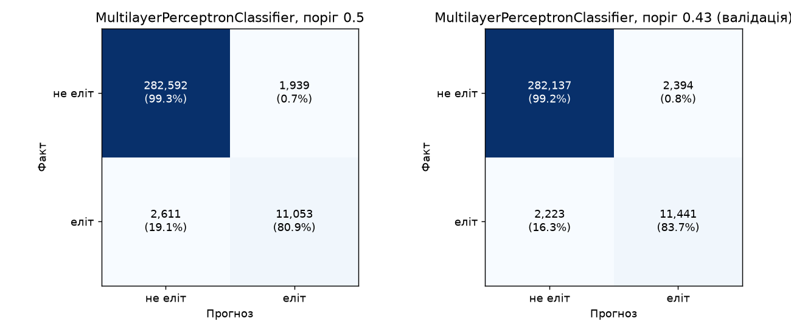

* **Accuracy тут малоінформативна**: модель «ніхто не еліт» уже має 0,954, тому порівнюємо за F1 і PR-AUC.
* **Парний bootstrap** нейронна мережа проти лісу: PR-AUC +0,008 [0,006; 0,009], мережа краща в 100% вибірок.
* **Найважливіші ознаки**: сума компліментів, голоси `cool`, кількість фанів, компліменти `cool` і `writer`, кількість
  відгуків. У логістичній регресії: більше компліментів і відгуків → вища ймовірність еліти, а **довший стаж при тій самій
  активності → нижча** (−0,78): еліта — це активність у перерахунку на час.

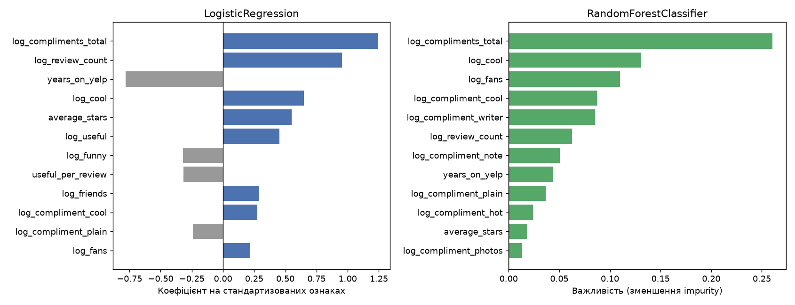

## 6. Порівняння алгоритмів і висновки

* **Регресія:** градієнтний бустинг (GBT) найточніший (R² 0,803), factorization machine трохи кращий за лінійну регресію
  (0,786 проти 0,780) завдяки попарним взаємодіям ознак, але навчається в ~30 разів довше і найчутливіший до кроку
  навчання. Лінійна регресія — найшвидша і майже така ж точна: залежність `log(1+fans)` від логарифмованих активностей
  близька до лінійної.
* **Класифікація:** нейронна мережа найкраща (F1 0,832, PR-AUC 0,914) і не перенавчається; випадковий ліс близький
  (F1 0,828), але глибокі дерева перенавчаються; логістична регресія трохи слабша (F1 0,815), зате в 13–25 разів швидша
  й найзручніша для інтерпретації.
* Усі моделі значно кращі за базові рівні (R² 0 і F1 0,678 для правила за кількістю відгуків); різниці між моделями
  невеликі, але статистично значущі.
* Для обох задач більше даних мало що дає після ~0,3–0,7 млн рядків: якість обмежена ознаками, а не обсягом.

## 7. Обмеження

* **Зворотний зв'язок ознак і цілей.** Фанів, голоси й компліменти користувачу дають інші люди, часто *через* те, що він
  помітний або має значок Elite. Тому моделі значною мірою вчаться розпізнавати «вже популярного/елітного» користувача,
  а не передбачати, хто ним стане.
* Ознаки — знімок на 2022-01-19 без часової історії; `is_elite` означає «був еліт хоча б раз», а не «еліт зараз».
* GBT ще покращувався на 100-й ітерації; більший бюджет дерев міг би трохи покращити результат ціною часу.
* Важливість ознак у деревах (зменшення impurity) завищує вагу неперервних ознак, тому наведено також коефіцієнти
  лінійних моделей. Для нейронної мережі важливість ознак не обчислювалася.
* Усі результати отримано на одному ноутбуці (Spark `local[8]`, 8 ГБ heap, Java 21); час навчання — орієнтовний.

## 8. Відтворення

```bash
uv sync
uv run -m src.artifacts.download                                    # набір даних Yelp
uv run jupyter nbconvert --to notebook --execute --inplace src/notebooks/ml_models.ipynb   # ~27 хв, 8 ядер
uv run -m src.ml.run --quick                                        # швидка перевірка (~4 хв) у results/ml/quick
uv run pytest                                                       # юніт-тести
```

Розбиття та випадкові зерна фіксовані (`ML_SEED = 42`).
