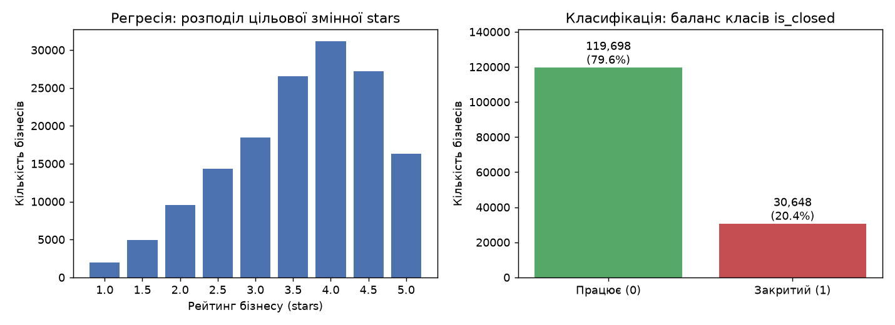
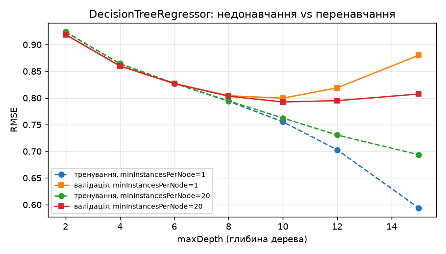
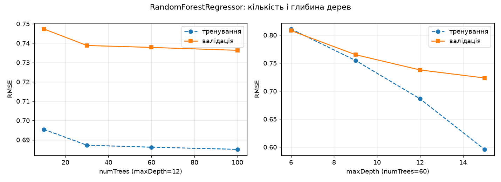
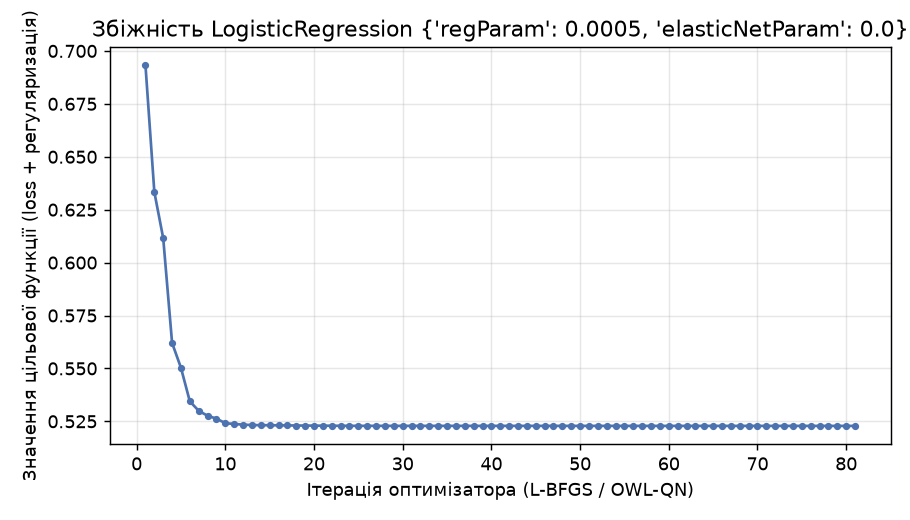
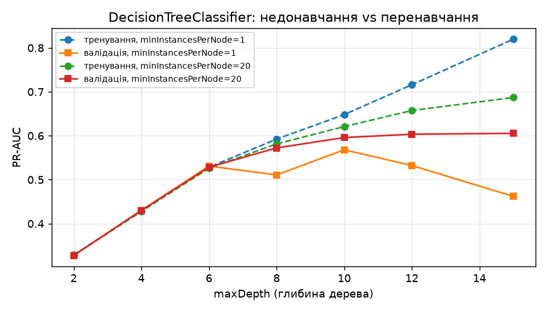
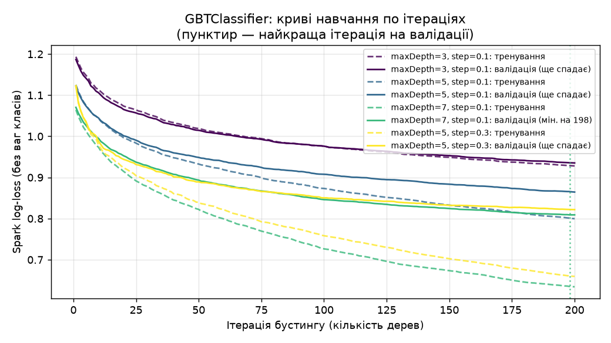
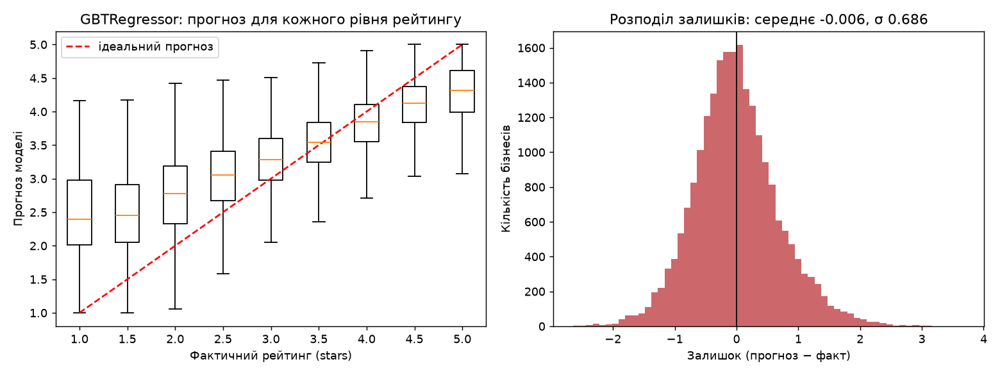
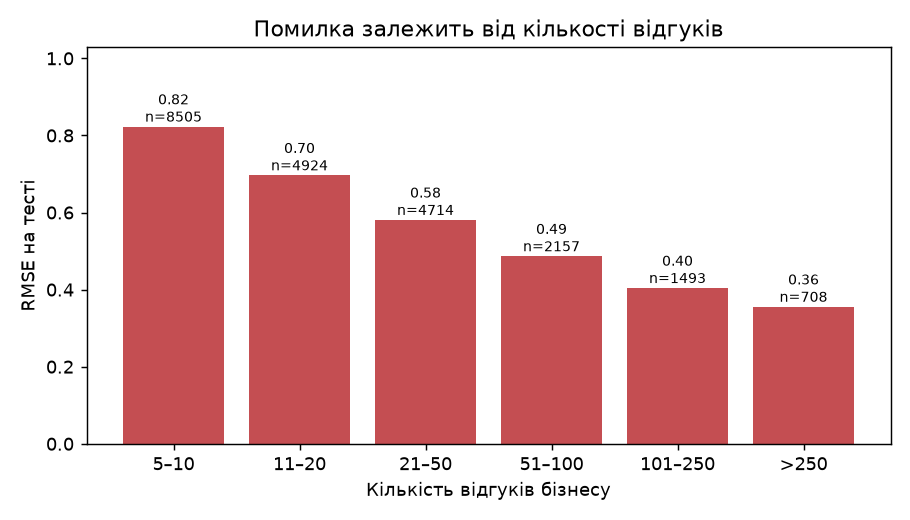
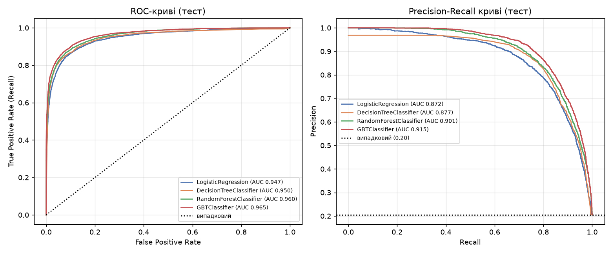
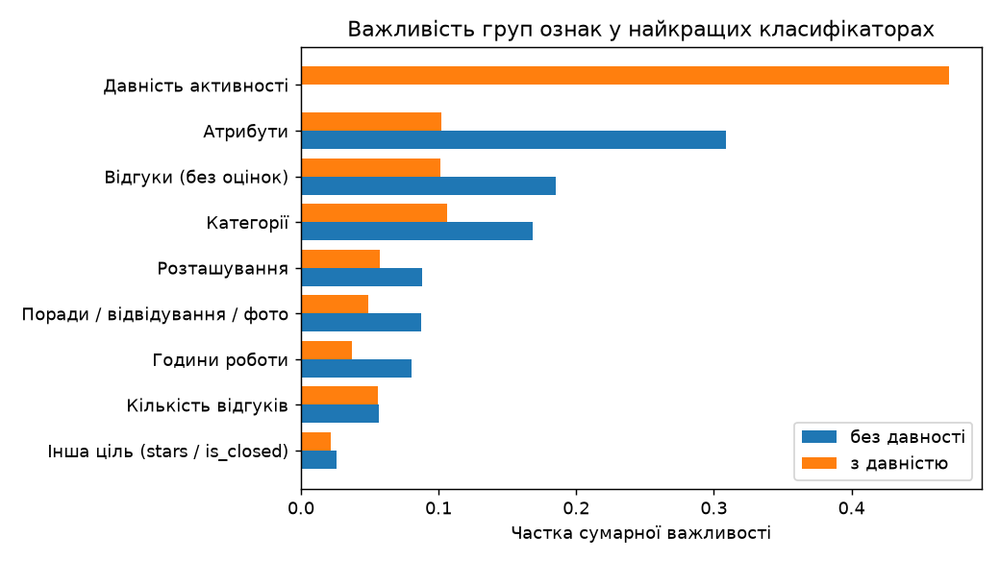

# Етап машинного навчання

Регресійна та класифікаційна моделі в PySpark ML для набору даних Yelp на рівні **бізнесу** (150 346 записів).

* **Регресія** — прогноз рейтингу бізнесу `stars` (1–5 з кроком 0,5). Найкраща модель — `GBTRegressor`:
  RMSE **0,686**, R² **0,503** на тестовій вибірці (базовий рівень «середнє»: RMSE 0,973, R² 0).
* **Класифікація** — виявлення закритих бізнесів `is_closed` (20,4% записів). Найкраща модель — `GBTClassifier`:
  Accuracy **0,820**, Precision **0,546**, Recall **0,707**, F1 **0,616** для класу «закритий» (поріг 0,5)
  без ознак давності активності; з ними F1 зростає до **0,810**.

Код: [`src/ml/`](../../ml) · зошит з усіма виводами: [`src/notebooks/ml_models.ipynb`](../../notebooks/ml_models.ipynb) ·
автоматично згенеровані таблиці: [`results.md`](results.md) та [`tables/*.csv`](tables) · рисунки: [`figures/`](figures).

## Відповідність вимогам

| Вимога | Розділ звіту | Розділ зошита | Файли |
| --- | --- | --- | --- |
| 1. Регресійна та класифікаційна модель у PySpark | 1 | 3, 4 | `src/ml/training.py`, `src/ml/models.py` |
| 2. Попередня обробка даних | 2 | 2 | `src/ml/features.py`, `src/ml/pipeline.py` |
| 3. Мінімум 3 моделі для кожної задачі | 3 | 3.1, 4.1 | `src/ml/models.py` (по 4 моделі) |
| 4. Навчання та аналіз процесу навчання | 4 | 3.2, 4.2 | `src/ml/training.py`, `src/ml/plots.py` |
| 5. Метрики: RMSE, R²; Accuracy, Precision, Recall, F1 | 5 | 3.3, 4.3, 4.4 | `src/ml/evaluation.py` |
| 6. Порівняння алгоритмів | 6 | 3.3, 4.3–4.4, 5 | `tables/*_comparison.csv` |

## 1. Постановка задач

| | Регресія | Класифікація |
| --- | --- | --- |
| Ціль | `stars` — середній рейтинг бізнесу | `is_closed = 1 − is_open` |
| Тип | неперервна (9 рівнів 1,0…5,0) | бінарна, позитивний клас — «закритий» (20,4%) |
| Практичний зміст | оцінити очікуваний рейтинг за описом бізнесу та активністю відвідувачів | знайти картки бізнесів, які вже не працюють |
| Критерій вибору моделі | мінімальний RMSE на validation | максимальний PR-AUC на validation (не залежить від порогу) |



## 2. Попередня обробка даних

### 2.1 Одиниця аналізу та джерела

Один рядок = один бізнес (150 346 записів). Ознаки зібрано з п'яти таблиць Yelp (`src/ml/features.py`):

| Джерело | Обсяг | Що береться |
| --- | --- | --- |
| `business` | 150 346 рядків, 119 МБ | розташування, `review_count`, `attributes`, `categories`, `hours`; цілі `stars`, `is_open` |
| `review` | 6 990 280 рядків, 5,3 ГБ | **без оцінок**: середні `useful/funny/cool`, середня довжина тексту, дати першого/останнього відгуку |
| `tip` | 908 915 рядків | кількість порад, середні компліменти, дата останньої поради |
| `checkin` | 13,4 млн відміток у 131 930 рядках | кількість відвідувань, остання дата, частка за останній рік |
| `photo` | 200 100 рядків | кількість фото та частки за мітками `food/inside/outside/drink/menu` |

Таблицю ознак обчислено один раз (≈1–2 хв, повний прохід по 5,3 ГБ відгуків) і збережено у Parquet
`artifacts/processed/ml/business_features`. «Сьогодні» знімка даних — дата останнього відгуку, 2022-01-19.

### 2.2 Очищення та розбір «брудних» полів

* **`attributes`** зберігаються як рядки у форматі Python: `"True"`, `"u'free'"`, `"'none'"`, `"None"`,
  вкладені словники `"{'casual': True, u'classy': False, 'divey': None}"`.
  * 17 булевих атрибутів → `1 / −1 / 0` (так / ні / невідомо): «невідомо» несе інформацію, тому не заповнюється медіаною;
  * `WiFi`, `NoiseLevel`, `Alcohol`, `RestaurantsAttire` → категорії без лапок і префікса `u` (інакше `u'free'` і `'free'`
    були б різними рівнями); голе `None` → рівень `missing`, а `'none'` (наприклад, «алкоголь не подають») — окремий справжній рівень;
  * `Ambience`, `BusinessParking`, `GoodForMeal` → 20 прапорців `1 / −1 / 0` за підключами;
  * `RestaurantsPriceRange2` → число 1–4 (відсутнє → медіана train).
* **`hours`** (`"8:0-18:30"`) → кількість робочих днів, годин на тиждень, робота у вихідні, після 22:00, до 8:00;
  закриття після півночі враховується (+24 год). Значення `0:0-0:0` неоднозначне (цілодобово чи «не задано») →
  окремий прапорець, у підрахунку годин не бере участі.
* **`categories`** (рядок через кому) → масив у нижньому регістрі + кількість категорій.
* **`state`**: 13 «сміттєвих» штатів з 1–4 бізнесами → `OTHER`.
* Лічильники з важкими хвостами → `log1p`; «ніколи не було» (немає порад/відвідувань) → кількість 0, давність = вік бізнесу.
* Spark 4 працює в ANSI-режимі: невдалий `cast`, вихід за межі масиву чи ділення на 0 **кидають виняток**, тому скрізь
  використано `try_cast`, `try_to_date`, `get`, `try_divide`. Після побудови перевіряється, що `business_id` унікальні,
  а всі «днів з моменту…» ≥ 0. Розбір покрито юніт-тестами (`tests/ml/test_features.py`).

### 2.3 Каталог ознак

| Група | К-сть | Ознаки | Джерело |
| --- | --- | --- | --- |
| Розташування | 2 + штат | `latitude`, `longitude`, `state` (one-hot) | business |
| Популярність | 1 | `log_review_count` | business |
| Категорії | 1 + 60 | `n_categories`, 60 найчастіших категорій у train (бінарні) | business |
| Атрибути | 39 + 4 кат. | 17 булевих + 20 вкладених прапорців, `price_range`, `n_attributes`; `wifi`, `noise_level`, `alcohol`, `attire` (one-hot) | business |
| Години роботи | 7 | `has_hours`, `n_open_days`, `weekly_open_hours`, `open_weekend`, `open_late`, `opens_early`, `hours_zero_format` | business |
| Відгуки (без оцінок) | 5 | `avg_review_useful/funny/cool`, `avg_review_length`, `business_age_days` | review |
| Поради / відвідування / фото | 9 | `log_n_tips`, `avg_tip_compliments`, `log_n_checkins`, `log_n_photos`, частки фото за мітками | tip, checkin, photo |
| Давність активності | 5 | `days_since_last_review/tip/checkin`, `share_reviews_last_year`, `share_checkins_last_year` | review, tip, checkin |
| Інша ціль | 1 | `is_closed` (для регресії) / `stars` (для класифікації) | business |

Разом після кодування: 167 ознак (регресія, класифікація з давністю), 162 (основна класифікація без давності).

### 2.4 Захист від витоку цільової змінної

* Жодних агрегатів `review.stars` і `user.average_stars`: рейтинг бізнесу — це округлене середнє оцінок відгуків.
* Жодних ознак зі *змісту* тексту (слова, тональність). Середня довжина тексту та голоси `useful/funny/cool` — використано;
  вони корелюють з тональністю відгуків, тому наведено абляцію «лише профіль» як нижню межу (розд. 5.1).
* Для класифікації ознаки давності активності є переважно *наслідком* закриття (закритий бізнес перестає отримувати
  відгуки) → основний варіант без них, додатковий — з ними (розд. 5.3).
* Усе, що навчається на даних (медіани, рівні категорій, словник категорій, масштаб), навчається **лише на train**.
* Командний ETL (`src/preprocessing`) не використано: він масштабує ознаки по всьому набору (статистики тесту потрапляють
  у тренування) і залишає сирі рядки атрибутів.

### 2.5 Конвеєр Spark ML (fit лише на train)

`Imputer(median)` → `StringIndexer(handleInvalid=keep)` + `OneHotEncoder` →
`CountVectorizer(binary, 60 найчастіших категорій, minDF=50)` → `VectorAssembler` → `StandardScaler(withStd)`.
Стандартизація потрібна для порівнянності коефіцієнтів лінійних моделей; на дерева вона не впливає.
Невідомі на train рівні категорій потрапляють в окремий слот, а не викликають помилку (перевірено тестом).

### 2.6 Розбиття

`xxhash64(business_id, seed=42) mod 100`: кошики 0–69 → train, 70–84 → validation, 85–99 → test. Розбиття
детерміноване, однакове для обох задач і всіх запусків і не залежить від розбиття на партиції.

| Вибірка | Рядків | Середній `stars` | Частка закритих |
| --- | --- | --- | --- |
| train | 105 191 | 3,595 | 20,5% |
| validation | 22 654 | 3,604 | 19,9% |
| test | 22 501 | 3,599 | 20,5% |

Розподіли цілей у частинах практично однакові, тому окрема стратифікація не потрібна.

## 3. Моделі та протокол навчання

| Модель (регресія / класифікація) | Сітка гіперпараметрів | Спроб |
| --- | --- | --- |
| `LinearRegression` / `LogisticRegression` (L-BFGS) | `regParam` ∈ {0,0005; 0,005; 0,05} × `elasticNetParam` ∈ {0; 0,5; 1} | 9 |
| `DecisionTreeRegressor` / `DecisionTreeClassifier` | `maxDepth` ∈ {2, 4, 6, 8, 10, 12, 15} × `minInstancesPerNode` ∈ {1, 20} | 14 |
| `RandomForestRegressor` / `RandomForestClassifier` | `numTrees` ∈ {10, 30, 60, 100} при глибині 12 + `maxDepth` ∈ {6, 9, 15} при 60 деревах | 7 |
| `GBTRegressor` / `GBTClassifier` | (`maxDepth`, `stepSize`) ∈ {(3; 0,1), (5; 0,1), (7; 0,1), (5; 0,3)}, `maxIter` = найкраща ітерація ≤ 200 | 4 |

Протокол однаковий для всіх моделей:

1. кожна точка сітки навчається на **train**; записуються час навчання та метрики на train і validation;
2. найкраща точка обирається на **validation** (RMSE / PR-AUC);
3. обрана модель, навчена лише на train, оцінюється **один раз на test** (без донавчання на train+validation, тому
   криві навчання, обраний поріг і тестові метрики описують одну й ту саму модель);
4. для класифікаторів — ваги класів `w_c = N / (2·n_c)` (лише при навчанні; метрики рахуються без ваг);
5. регресійні прогнози обрізаються до [1; 5]; для тестових метрик — 95% bootstrap-інтервали (1000 повторних вибірок).

Precision / Recall / F1 рахуються **для класу «закритий»** з матриці помилок. Стандартний
`MulticlassClassificationEvaluator` за замовчуванням звітує клас 0 і зважений F1, тому не використовується. AUC
обчислюються за ймовірністю P(закритий): для дерева рішень колонка `rawPrediction` містить кількості прикладів у листку,
а не ймовірності, і давала б хибний ROC-AUC/PR-AUC (покрито тестом).

## 4. Аналіз процесу навчання

### 4.1 Регресія


* **Лінійна регресія** зійшлася за 93 ітерації L-BFGS. Найкраща найслабша регуляризація (`regParam` 0,0005):
  val RMSE 0,776, а сильна L1-регуляризація (0,05; 1,0) погіршує до 0,848. Train і validation майже однакові
  (0,781 / 0,776) — модель обмежена зміщенням (лінійна форма), а не перенавчанням.



* **Дерево рішень** — класична U-подібна картина: від глибини 2 (val RMSE 0,919) до 10 (0,793) помилка падає,
  далі без обмеження листків дерево перенавчається (глибина 15: train 0,594, val 0,880). `minInstancesPerNode=20`
  стримує перенавчання (0,807 на глибині 15). Обрано глибину 10, `minInstancesPerNode=20`.



* **Випадковий ліс**: зі зростанням кількості дерев (10→100) val RMSE 0,747→0,736, після ~30 дерев покращення
  мізерне. Глибина важливіша: 6 → 15 дає 0,808 → 0,723; усереднення дерев компенсує їх дисперсію, тому глибокі
  дерева тут не шкодять (train 0,596 — помітний, але контрольований розрив). Обрано 60 дерев глибини 15.


* **Градієнтний бустинг**: при `stepSize` 0,1 помилка на validation ще повільно спадає на 200-й ітерації
  (глибина 3: 0,711; глибина 5: 0,691), а розрив train/val росте з глибиною (глибина 7: train 0,557, val 0,692).
  При `stepSize` 0,3 мінімум досягається на **126-й ітерації** (0,699), після чого помилка на validation зростає —
  перенавчання за кількістю ітерацій. Обрано глибину 5, крок 0,1, 200 ітерацій.


* **Крива навчання GBT**: на 6 109 рядках train RMSE 0,356 проти val 0,782 (запам'ятовування), на 105 191 —
  0,651 проти 0,691. Розрив швидко скорочується, а val ще трохи покращується — більше даних дало б невеликий приріст.


### 4.2 Класифікація







* **Логістична регресія** зійшлася за 81 ітерацію; як і в регресії, найкраща слабка регуляризація (val PR-AUC 0,624),
  а сильна L1 (0,05; 1,0) знижує до 0,469. Train ≈ validation (0,618 / 0,624).
* **Дерево рішень** без обмеження листків перенавчається вже після глибини 6 (val PR-AUC 0,531 → 0,462 на глибині 15
  при train 0,820); з `minInstancesPerNode=20` validation стабілізується на ~0,60. Обрано глибину 15, мінімум 20 у листку.
* **Випадковий ліс**: 10 → 60 дерев — 0,652 → 0,669, далі насичення; глибина 15 дає 0,682.
* **GBT**: функція втрат (log-loss) на validation спадає до кінця бюджету в усіх конфігураціях; найкраща —
  глибина 7 (мінімум на 198-й ітерації, val PR-AUC 0,719).
* **Крива навчання GBT**: на 6 109 рядках модель майже ідеально запам'ятовує train (PR-AUC 1,000), а val лише 0,617;
  на повному train — 0,856 / 0,719. Задача обмежена дисперсією, і обсяг даних тут допомагає сильніше, ніж у регресії.
* **Час**: дерево ~1 с на навчання, лінійні моделі ~4 с, ліс ~9–21 с, GBT ~50–110 с (200 послідовних дерев).
  Увесь зошит виконується ≈37 хв на 8 ядрах.


## 5. Оцінка якості моделей (тестова вибірка)

### 5.1 Регресія: RMSE, R²

| Модель | RMSE | R² | MAE | Частка прогнозів ±0,5★ | 95% CI RMSE | Найкращі параметри | Навчання, с |
| --- | --- | --- | --- | --- | --- | --- | --- |
| Базова: середнє train | 0,973 | 0,000 | 0,796 | 38,5% | — | — | — |
| Базова: середнє за штат × категорія | 0,921 | 0,104 | 0,744 | 39,5% | — | — | — |
| LinearRegression | 0,776 | 0,364 | 0,610 | 49,6% | [0,768; 0,783] | regParam 0,0005, L2 | 4,4 |
| DecisionTreeRegressor | 0,788 | 0,343 | 0,614 | 50,8% | [0,781; 0,797] | глибина 10, ≥20 у листку | 0,9 |
| RandomForestRegressor | 0,722 | 0,450 | 0,565 | 53,0% | [0,715; 0,730] | 60 дерев, глибина 15 | 52,6 |
| **GBTRegressor** | **0,686** | **0,503** | **0,527** | **57,7%** | [0,679; 0,693] | глибина 5, крок 0,1, 200 ітерацій | 64,2 |

Train / validation / test RMSE: LinearRegression 0,781 / 0,776 / 0,776; DecisionTree 0,762 / 0,793 / 0,788;
RandomForest 0,596 / 0,723 / 0,722; GBT 0,651 / 0,691 / 0,686. Validation і test збігаються для всіх моделей —
вибір гіперпараметрів не «підігнаний» під validation.


* **Парний bootstrap** GBT проти RandomForest: різниця RMSE −0,036 [−0,039; −0,032], GBT кращий у 100% повторних вибірок.
* **Абляція «лише профіль»** (без агрегатів відгуків, порад, відвідувань і фото): GBT дає RMSE 0,789, R² 0,342.
  Тобто опис бізнесу пояснює ~34% дисперсії рейтингу, а характеристики відгуків (без оцінок) додають ще ~16 п.п.
* **Діагностика**: модель «стискає» прогнози до середнього — медіана прогнозу для бізнесів з 1★ ≈ 2,4★, з 5★ ≈ 4,3★;
  залишки симетричні (середнє −0,006). Помилка сильно залежить від кількості відгуків: RMSE 0,82 для бізнесів
  з 5–10 відгуками проти 0,36 для бізнесів з понад 250 — рейтинг з кількох відгуків сам по собі шумний.
* **Найважливіші ознаки**: `avg_review_cool`, `avg_review_length`, `weekly_open_hours`, `avg_review_funny`,
  `avg_review_useful`, `n_open_days`, `log_n_checkins`, `category=fast food`. За групами: відгуки 34%, категорії 20%,
  атрибути 17%, години роботи 13%. Коефіцієнти лінійної моделі: більше «cool» → вищий рейтинг (+0,33),
  довші відгуки, «funny» і «useful» → нижчий (негативні відгуки довші й частіше відмічені), фастфуд → нижчий (−0,12).





### 5.2 Класифікація: Accuracy, Precision, Recall, F1 (основний варіант, без ознак давності)

Метрики для класу «закритий», поріг 0,5:

| Модель | Accuracy | Precision | Recall | F1 | 95% CI F1 | Macro-F1 | ROC-AUC | PR-AUC | Найкращі параметри | Навчання, с |
| --- | --- | --- | --- | --- | --- | --- | --- | --- | --- | --- |
| Базова: усі «працює» | 0,795 | 0,000 | 0,000 | 0,000 | — | 0,443 | 0,500 | ≈0,20 | — | — |
| LogisticRegression | 0,756 | 0,440 | 0,716 | 0,545 | [0,535; 0,557] | 0,689 | 0,818 | 0,624 | regParam 0,0005, L2 | 4,2 |
| DecisionTreeClassifier | 0,747 | 0,425 | 0,673 | 0,521 | [0,510; 0,531] | 0,674 | 0,794 | 0,602 | глибина 15, ≥20 у листку | 2,2 |
| RandomForestClassifier | **0,836** | **0,597** | 0,616 | 0,606 | [0,593; 0,617] | **0,751** | 0,846 | 0,684 | 60 дерев, глибина 15 | 12,5 |
| **GBTClassifier** | 0,820 | 0,546 | **0,707** | **0,616** | [0,605; 0,627] | 0,749 | **0,862** | **0,719** | глибина 7, крок 0,1, 198 ітерацій | 83,9 |


* **Чому Accuracy нижча за базову (0,795) у лінійної моделі та дерева.** Модель, що завжди відповідає «працює», має
  Accuracy 0,795 і нульовий Recall. Ваги класів змушують моделі шукати закриті бізнеси, жертвуючи частиною правильних
  відповідей для більшого класу, тому головні метрики — F1 і PR-AUC для класу «закритий».
* **GBT проти RandomForest**: PR-AUC +0,035 [0,029; 0,042] (GBT кращий у 100% bootstrap-вибірок). За F1 інтервали
  перетинаються (0,616 vs 0,606), а відрізняється баланс: ліс точніший (Precision 0,597), бустинг повніший (Recall 0,707).
* **Поріг**: оптимальний для F1 поріг, обраний на validation, — 0,65; на тесті він дає Precision 0,671, Recall 0,595,
  F1 0,630, Accuracy 0,857.
* **Ваги класів vs поріг** (GBT):

| Ваги класів | Поріг | Accuracy | Precision | Recall | F1 | PR-AUC |
| --- | --- | --- | --- | --- | --- | --- |
| збалансовані | 0,50 | 0,820 | 0,546 | 0,707 | 0,616 | 0,719 |
| збалансовані | 0,65 (validation) | 0,857 | 0,671 | 0,595 | 0,630 | 0,719 |
| без ваг | 0,50 | 0,867 | 0,791 | 0,474 | 0,593 | 0,714 |
| без ваг | 0,33 (validation) | 0,857 | 0,669 | 0,597 | 0,631 | 0,714 |

  Ваги класів по суті зсувають поріг: якість ранжування (PR-AUC) майже однакова, а після підбору порогу обидва
  варіанти дають F1 ≈ 0,63.


* **Найважливіші ознаки** (GBT): `business_age_days`, `log_review_count`, `avg_review_length`, `weekly_open_hours`,
  `latitude`, `n_attributes`, `log_n_checkins`. За групами: атрибути 31%, відгуки 19%, категорії 17%, розташування 9%.
  Логістична регресія: більше відгуків → менша ймовірність закриття (−0,80), ресторани закриваються частіше (+0,38),
  більше заповнених атрибутів і наявність доставки → рідше закриття.


### 5.3 Класифікація з ознаками давності активності

Ті самі 4 моделі з тими самими гіперпараметрами (GBT заново обирає кількість ітерацій) + базове правило
«закритий, якщо останній відгук старший за N днів», N = 1007 обрано на validation:

| Модель | Accuracy | Precision | Recall | F1 | ROC-AUC | PR-AUC |
| --- | --- | --- | --- | --- | --- | --- |
| Базова: усі «працює» | 0,795 | 0,000 | 0,000 | 0,000 | 0,500 | ≈0,20 |
| Базове правило: ≥ 1007 днів без відгуків | 0,880 | 0,704 | 0,716 | 0,710 | — | — |
| LogisticRegression | 0,897 | 0,705 | 0,857 | 0,774 | 0,947 | 0,872 |
| DecisionTreeClassifier | 0,888 | 0,674 | 0,872 | 0,760 | 0,950 | 0,877 |
| RandomForestClassifier | 0,909 | 0,737 | 0,864 | 0,796 | 0,960 | 0,901 |
| **GBTClassifier** | **0,917** | **0,758** | 0,870 | **0,810** | **0,965** | **0,915** |




Одна ознака `days_since_last_review` дає 35% важливості GBT, уся група давності — 47%; одне правило-поріг уже має
F1 0,71. Ці ознаки корисні для практичного завдання «знайти застарілі картки» (з порогом 0,72, обраним на validation,
GBT досягає Precision 0,848, Recall 0,812, F1 0,830), але описують наслідок закриття, тому основним вважається
варіант 5.2.

## 6. Порівняння алгоритмів і висновки

* **Найкращий алгоритм в обох задачах — градієнтний бустинг (GBT)**: R² 0,503 у регресії та PR-AUC 0,719 / F1 0,616
  у класифікації; перевага над наступною моделлю (RandomForest) статистично значуща за парним bootstrap.
  Ціна — найдовше навчання (~1–1,5 хв на модель проти ~1 с для дерева).
* **Випадковий ліс** — другий за якістю і швидший за GBT (середній час навчання за сіткою 21 с / 9 с проти 67 с / 58 с;
  дерева лісу будуються паралельно, а бустингу — послідовно). У класифікації має найвищі Accuracy (0,836) і
  Precision (0,597). Добрий вибір, якщо важливіший час навчання або точність позитивних прогнозів.
* **Лінійні моделі** стабільні (train ≈ test) і швидкі, але обмежені лінійною формою: R² 0,364, F1 0,545. Їхні
  стандартизовані коефіцієнти найзручніші для інтерпретації.
* **Одиночне дерево рішень** — найгірше в обох задачах і найбільш схильне до перенавчання; ансамблі дерев (ліс, бустинг)
  виправляють саме цю ваду.
* Усі моделі значно кращі за базові рівні (RMSE 0,973 / 0,921; F1 0). Регресія пояснює близько половини дисперсії
  рейтингу без використання оцінок відгуків; виявлення закритих бізнесів лише за профілем складне (F1 ≈ 0,62),
  а з ознаками давності активності стає майже тривіальним (F1 ≈ 0,81).

## 7. Обмеження

* **Класифікація — це виявлення вже закритих бізнесів, а не прогноз майбутнього закриття.** Атрибути й години роботи
  відображають стан картки на момент знімка; закриті бізнеси перестають її оновлювати, тому навіть ознаки профілю
  частково кодують «свіжість» картки (новіші атрибути, формат `0:0-0:0`, кількість атрибутів). COVID-19 (2020–2021)
  знизив активність і в тих бізнесів, що працюють.
* Довжина тексту та голоси відгуків пов'язані з тональністю тих самих відгуків, з яких складається `stars`;
  абляція «лише профіль» (R² 0,342) показує якість без них.
* Розбиття випадкове: сусідні бізнеси (той самий ТЦ, вулиця) потрапляють і в train, і в test, тож координати можуть
  частково «запам'ятовувати» місцевий рівень. Перевірку з розбиттям за містами не виконано.
* GBT з кроком 0,1 ще покращувався на 200-й ітерації; більший бюджет ітерацій міг би трохи покращити результат ціною
  часу навчання.
* Важливість ознак у деревах (зменшення impurity) завищує вагу неперервних ознак; тому наведено також частки за
  групами ознак і стандартизовані коефіцієнти лінійних моделей.
* Усі результати отримано на одному ноутбуці (Spark `local[8]`, 8 ГБ heap, Java 21); час навчання — орієнтовний.

## 8. Відтворення

```bash
uv sync
uv run -m src.artifacts.download                   # набір даних Yelp (≈16 ГБ)
SPARK_MAX_CORES=8 uv run -m src.ml.run             # повний запуск (~37 хв), --quick — перевірка за ~6 хв
uv run jupyter nbconvert --to notebook --execute --inplace src/notebooks/ml_models.ipynb
uv run pytest                                      # юніт-тести розбору ознак, розбиття, метрик
```

Розбиття, сітки й випадкові зерна фіксовані (`ML_SEED = 42`), тому повторний запуск відтворює ті самі метрики;
змінюється лише час навчання.
